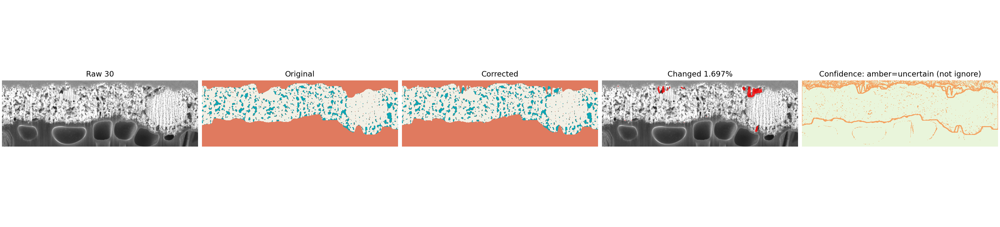
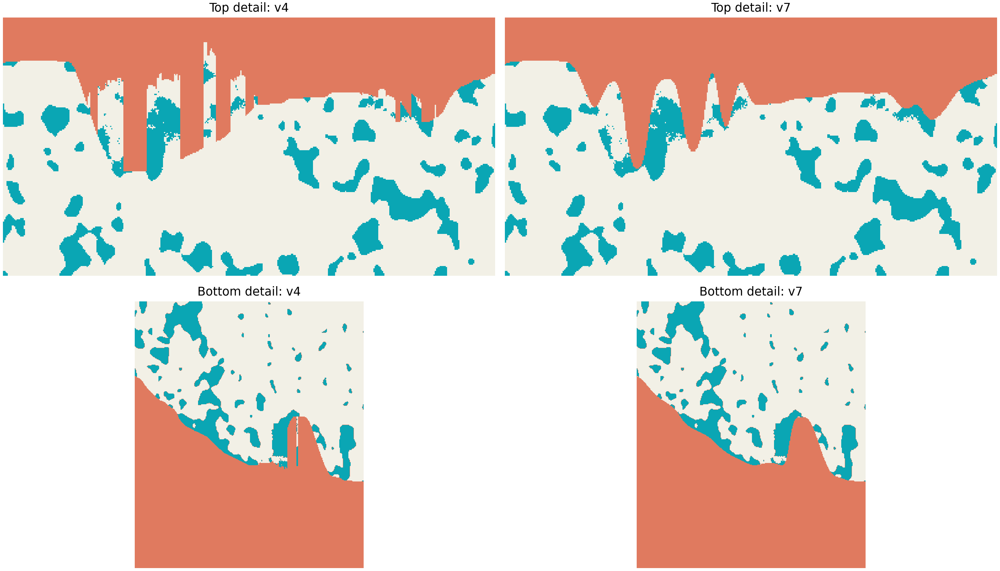
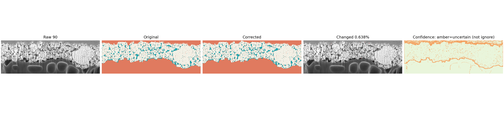
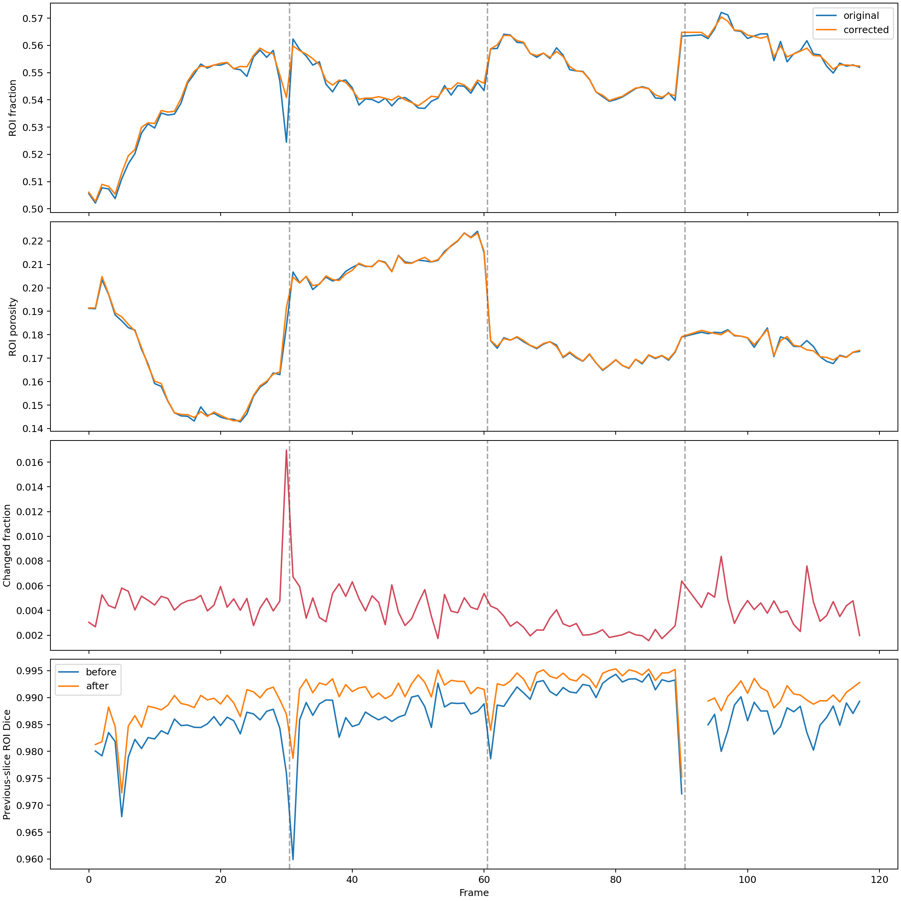

# Final v7 material-boundary correction

`experiments/auto_correct_real_masks.py` is the selected final workflow for regularizing the material/ignore boundary in the real pFIB-SEM masks. It is deterministic, uses no segmentation-model predictions, and requires no additional manual annotation to run.

## Label semantics

The exported PNG masks use:

- `0`: pore
- `128`: ignore/outside the material
- `255`: solid

Pore and solid together form the material region of interest (ROI). Ignore is only for space outside that material. Therefore, an ignore component completely enclosed by the material is physically inconsistent and must be reassigned to pore or solid.

## Input annotation workflow

The source volume is `comp_full.tif`. The current masks in `manual_annotation/` were produced from the initial masks with the following workflow:

1. Open the original pFIB-SEM stack and initial masks in napari.
2. Correct the material/ignore boundary with the Solid brush. Pores do not need to be manually redrawn at this stage.
3. Use grayscale thresholding to separate pore from solid within the corrected material ROI.
4. Review the preview and export the masks as `0/128/255` PNG files.

Different annotators covered approximately frames 0-30, 31-60, 61-90, and 91-120. This can create abrupt changes at the range transitions, and individual 2D edits can also introduce narrow notches or jagged surfaces that are inconsistent with adjacent slices.

## Final automated method

The script treats each mask as one continuous material band and extracts its top and bottom surfaces. It then applies these stages in order:

1. **Five-slice temporal consensus:** a radius of 2 uses up to `[z-2, z-1, z, z+1, z+2]` to identify abrupt surface outliers.
2. **Image-gradient snapping:** accepted boundary proposals can move by at most 3 pixels to a nearby raw-image edge.
3. **Unsupported indentation repair:** a deep, narrow indentation is corrected only when it is inconsistent with the local surface, has weak image-edge evidence, and is supported by fewer than 3 slices in the five-slice window.
4. **Narrow-spike smoothing:** short jagged runs are replaced with a 9-column spatial prior plus bounded temporal consensus; broad cavities are preserved.
5. **Continuous-curve smoothing:** a sigma-4 horizontal Gaussian prior rounds pixel-scale corners, while temporal influence is limited to 0.15 and at most a 2-pixel shift.
6. **Topology enforcement:** every ignore component must connect to an image border. Enclosed ignore islands are classified as pore or solid with a grayscale threshold fitted from the training frames.

Existing pore/solid labels are preserved wherever the original and corrected ROIs overlap. The grayscale threshold is used only for pixels newly brought into the material and for enclosed ignore islands; it does not reclassify the full annotated mask.

## Design choices

- **Radius 2:** five slices provide enough z-context to suppress single-slice annotation artifacts without flattening legitimate 3D changes over a long range.
- **Top/bottom surfaces:** the specimen is a continuous material band across every image column, so surface regularization directly represents the physical ROI and prevents internal ignore regions.
- **Gradients are supporting evidence, not a hard rule:** true material boundaries often produce image edges, but pore/solid texture also contains strong edges. Requiring an edge would preserve annotation errors; ignoring edges would over-smooth real geometry.
- **No fixed hole-size rule:** a large exterior-connected hole can be real. Broad or temporally supported cavities are retained regardless of size.
- **Conservative phase handling:** preserving existing pore/solid labels isolates this procedure to the boundary problem and avoids silently changing manual phase annotations.
- **Sigma 4 curve prior:** weaker smoothing left visible stair-step artifacts, while stronger smoothing distorted broad geometry; sigma 4 was the selected compromise on the real masks.

## Run

From the repository root:

```bash
conda run --no-capture-output -n base python \
  experiments/auto_correct_real_masks.py \
  --stack comp_full.tif \
  --mask-dir manual_annotation \
  --output-dir real_data_runs/real_mask_correction_v7_final_20261006 \
  --panel-count 30
```

The defaults above are the finalized v7 configuration. Ablation flags such as `--no-curve-smoothing`, `--no-surface-smoothing`, and `--no-indentation-repair` should not be used for the final masks.

## Outputs

The output directory contains:

- `corrected_masks/`: final `0/128/255` masks to use for training and evaluation
- `confidence_masks/`: confidence maps; `255` is high confidence and `0` marks boundary or threshold-ambiguous pixels
- `correction_summary.json`: parameters, aggregate metrics, and method metadata
- `split.json`: distributed train/validation/test frames and context-buffer frames
- `mask_correction_report/per_frame_mask_audit.csv`: per-frame change and consistency metrics
- `mask_correction_report/z_consistency_audit.png`: z-direction audit plot
- `mask_correction_report/panels/`: raw/original/corrected/change/confidence panels

The distributed split avoids putting the test set in one continuous region, where neighboring frames would be nearly duplicates. Radius-2 buffer frames prevent context leakage around validation and test blocks.

## Example results

Each five-column panel shows the raw image, original mask, corrected mask, changed pixels, and confidence map. Changes are concentrated at the material/ignore boundary; existing pore/solid labels in the shared ROI remain unchanged.

### Slice 30: largest correction and annotator transition

Slice 30 has the largest changed-pixel fraction (`1.6974%`) and lies at the 30/31 annotator-range transition. The correction removes unsupported boundary notches, fills enclosed ignore islands, and rounds the stair-step surface without flattening the broad material geometry.



The detailed v4-to-v7 comparison below shows why the final narrow-spike and continuous-curve stages were retained. On this slice, the maximum local bottom-surface deviation decreased from 65 pixels in v4 to 1 pixel in v7; the top-surface deviation decreased from 17 to 7 pixels.



### Slices 60 and 90: additional annotator transitions

These panels show the same deterministic rules at the other manually annotated range transitions. The method uses neighboring slices and image evidence rather than copying either annotator's boundary wholesale.




### Volume-level consistency

The z-direction audit compares ROI fraction, porosity, changed fraction, and previous-slice ROI Dice before and after correction. Dashed vertical lines mark the annotator transitions. Mean adjacent-slice ROI Dice improves from `0.98675` to `0.99068`.



## Verification

Run the focused test suite:

```bash
conda run --no-capture-output -n base python -m pytest -q tests/test_boundary_adjustment.py
```

The tests cover unsupported-indentation repair, preservation of strong-edge and temporally supported geometry, preservation of broad exterior holes, narrow-spike smoothing, continuous-curve behavior, and prevention of temporal consensus from recreating a local spike.

The finalized real-data run should satisfy all of the following:

- 116 masks are produced;
- every mask contains only `0`, `128`, and `255`;
- no enclosed ignore pixels remain;
- pore/solid labels in the shared original ROI are unchanged;
- mean adjacent-slice ROI Dice improves from approximately `0.98675` to `0.99068`;
- the overall changed-pixel fraction is approximately `0.4117%`.

## Interpretation limit

These are automatically regularized annotations, not independent physical ground truth. The procedure reduces obvious topology, jaggedness, and cross-slice consistency errors, but it cannot prove that every boundary is physically correct. The report panels should be retained for traceability, and any benchmark using these masks should describe them as corrected pseudo-ground-truth.
