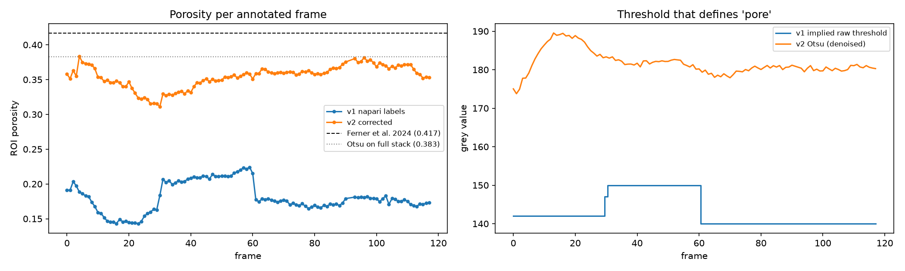
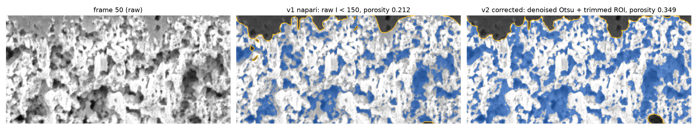

# Annotation audit and correction (v1 napari → v2)

Stack: `comp_full.tif` (354 × 630 × 1860, uint8, 6 nm pixels), frames 0–117.
Input: `data/manual_annotation/` (116 masks, `0` pore / `255` solid / `128` outside ROI).
Output: `data/annotations_v2/` (116 masks, same encoding, same file names except the fix below).
Reproduce: `eponge fix-annotations --stack data/raw/comp_full.tif --masks data/manual_annotation --out data/annotations_v2`.

## What was wrong with v1

| # | Finding | Evidence | Effect |
|---|---|---|---|
| 1 | Inside the ROI the pore/solid labels **are a raw grey-level threshold**, not hand painting | For 115 of 116 frames `pore == (I < t)` holds for 100.00 % of ROI pixels (`eponge audit-annotations`). Frame 30 agrees at 94.7 %; its differences are ~6,400 scattered few-pixel specks, i.e. a threshold on a slightly different image, not brush strokes. | Labels contain the detector shot noise (salt-and-pepper boundaries). This is why the earlier error analysis found 98.7 % of pore-error components ≤ 16 px and 84.5 % of errors within 3 px of a boundary: a network cannot predict noise. |
| 2 | **The threshold changes between annotation sessions** | t = 142 for frames 0–29, 147–150 for frames 30–60, 140 for frames 61–117 ([`figures/annotation_audit.png`](figures/annotation_audit.png), right) | Porosity jumps at frames 30 and 61 (0.16 → 0.21 → 0.17) while the image does not change. Training sees contradictory definitions of "pore". |
| 3 | **The thresholds are far too low** | Mean labelled-pore grey value is ~110, solid ~205; the denoised Otsu split is ~180. Mid-grey regions are pore back-walls seen through the opening (shine-through), but v1 calls them solid. | v1 ROI porosity 0.181 ± 0.021, about half of the published values for this region: 0.383 ± 0.024 (Otsu, literature review) and 0.417 (Ferner et al. 2024). Thresholding already *under*-estimates porosity because of shine-through, so 0.18 is not plausible. |
| 4 | The hand-drawn ROI line is loose | A rim of Pt cap (top) and membrane / delamination gap (bottom) lies inside the ROI | Those grey pixels are neither catalyst-layer pore nor solid. v1 called them solid; any pore rule calls them pore. |
| 5 | File naming | `slice_030.png` instead of `slice_0030.png`; frames 91–92 missing | Silent mis-ordering in tools that sort file names lexically. |

The ROI itself (the catalyst-layer outline) is genuinely manual and good: smooth, follows the layer, and consistent between frames (ROI Dice with the previous frame ≥ 0.96; the three lowest, frames 5, 31 and 90, coincide with session boundaries).

## What v2 does

1. **Keep the manual ROI**, remove specks and fill small holes (< 2,000 px).
2. **Trim the background rim**: intersect the ROI with the envelope of the solid network (binary closing with a 10 px = 60 nm disc, holes filled). On average 5.4 % of ROI pixels are removed, all Pt cap or membrane.
3. **One pore rule for every frame**: Gaussian denoise (σ = 1 px), per-frame Otsu threshold computed inside the trimmed ROI, `pore = smoothed < threshold`. Pore and solid specks below 6 px are removed. The rule is parameter-free and published (Otsu is the literature baseline for this stack).

| | v1 | v2 |
|---|---|---|
| ROI porosity, mean ± sd over frames | 0.181 ± 0.021 | 0.354 ± 0.016 |
| frames 0–29 / 30–60 / 61–117 | 0.162 / 0.210 / 0.174 | 0.346 / 0.343 / 0.365 |
| definition of pore | raw I < 140…150 (session-dependent) | denoised I < Otsu(ROI), per frame (~178–189) |
| slice-to-slice pore Dice (frames 61–90 / all frames) | 0.764 / 0.736 | 0.855 / 0.823 |

[`figures/before_after.png`](figures/before_after.png) shows the difference on a crop; `data/annotations_v2/correction_log.json` has per-frame numbers.

## Limitations: read before using v2 as ground truth

* v2 is still a threshold, only a consistent and denoised one. It is the best defensible single rule from the image alone, not an independent ground truth. The model trained on it is evaluated against it, so its test scores measure agreement with this rule; physical cross-checks (porosity against the literature, z-consistency, REV) carry the scientific weight.
* Otsu still labels bright shine-through as solid, so v2 porosity remains a lower bound (0.354 against Ferner's 0.417).
* A large pore touching the layer boundary can be trimmed together with the background rim (see the bottom right of the frame-50 figure).
* Recommended next step: two annotators paint ~20 random 256² patches each with ±3-slice context (Röding et al. 2021 protocol) in napari (`eponge/scripts/napari_review.py`), and report inter-annotator agreement as the accuracy ceiling.
