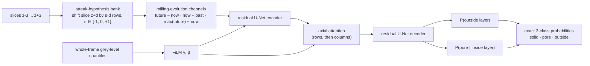

# MillNet: a segmentation network built around how a FIB-SEM stack is made

MillNet is the custom architecture of this project (`eponge/src/eponge/models/zoo.py`, `arch="millnet"`).
It keeps the proven small residual U-Net backbone and changes what the network is told about
the physics of serial-section milling. It has the same size as the ResUNet (2.55 M vs 2.39 M
parameters) and trains at the same speed.

**Result in one line:** +0.02 mIoU and +0.04 pore IoU over every other architecture tested
(including TransUNet), robust across seeds and augmentation; the gain comes from giving the network
frame-level context (ideas 3 and 4 below). The z-physics ideas (1 and 2) did not help on these
labels, for a reason explained in [Results](#results).

## Why not just a bigger network?

The architecture comparison ([MODELS.md](MODELS.md)) gave a clear negative result: five architectures
from 2.4 M to 105 M parameters, with and without ImageNet pretraining, CNNs and transformers, land
within 0.02 mIoU of each other. Capacity is not the bottleneck. A better model has to use
**information the others cannot see or are not told how to use**. MillNet is designed around five
such pieces of information.

## Design: five choices, each tied to a measured property of the data



### 1. Streak-hypothesis bank: align what slides

*Property.* Material seen through a pore opening lies behind the cut face. As the mill
approaches it, it slides in y by about one pixel per slice (52° stage geometry). We measured this
offset, and `pore_pipeline` estimates it independently (1.0 px/slice). Cut-face structures do not
move.

*Problem with existing 2.5D models.* Stacking neighbouring slices as plain input channels gives a
convolution misaligned copies of exactly the material that needs to be told apart from the cut
face: 3 px apart at ±3 slices, more than a 3 × 3 kernel spans.

*Choice.* Each neighbour slice z+d is presented three times: shifted by −d, 0 and +d rows. One
hypothesis aligns cut-face structure (static), and one aligns material sliding up or down. The
network learns which explanation fits each pixel. This costs channels in the first layer only.
The unit test `test_millnet_streak_bank_aligns_sliding_material` checks that a feature sliding
1 px/slice becomes exactly static in one hypothesis.

### 2. Milling-evolution channels: give the network the literature's best feature

*Property.* The FIB-SEM literature agrees on what separates cut face from shine-through: how a
feature's brightness evolves across slices. Back-wall material appears early and brightens until it
is milled; cut-face material is bright now and gone one slice later (Salzer et al. 2012, 2014;
Prill et al. 2013; Osenberg et al. 2023, where hand-designed "milling-evolution" features cut the
error from 23 % to 6 %).

*Choice.* For every streak hypothesis, three explicit channels: forward difference (next − now),
backward difference (now − previous) and future maximum minus now (Salzer's last-occurrence rule as a
feature: large where something brighter is still coming, i.e. we are looking through a pore). A CNN
can in principle learn differences, but giving them explicitly, already aligned, makes them usable
from the first layer and needs no extra data.

### 3. Global histogram conditioning: decide "pore" relative to the whole frame

*Property.* Whether a grey value is pore depends on the frame: brightness drifts along z
(`pore_pipeline` histogram-normalises every slice for this reason), and the labels themselves use a
per-frame threshold. A network trained on 256 px crops never sees the frame's histogram.

*Choice.* 16 quantiles of the whole frame (computed once per frame, not per crop) drive FiLM scale
and shift on the first and the deepest feature maps (Perez et al. 2018). The FiLM layer starts as the
identity. During training, gamma, contrast and brightness augmentation are applied to the image and
the quantiles alike; these transforms are monotonic, so they commute with quantiles exactly.

### 4. Axial attention: long-range context at low cost

*Property.* The catalyst layer is a long band, 1860 px wide and about 300 px thick; deciding
"inside the layer" near a dark gap benefits from context far along the band.

*Choice.* One row-attention and one column-attention block at the 1/32-resolution bottleneck
(Ho et al. 2019; Wang et al. 2020). Unlike a ViT, there are no learned position embeddings, so
it works on any image size without retiling. That matters because TransUNet had to be run on
256 px tiles.

### 5. Factorised head: two decisions, two outputs

*Property.* The three classes are hierarchical. "Inside the catalyst layer" is a smooth, global
decision; "pore or solid" is a fine, local one. A single softmax couples them, so a pore pixel at the
layer edge competes with "outside".

*Choice.* Two logits, `r` for outside and `u` for pore-given-inside, composed into exact
log-probabilities: log P(outside) = log σ(r), log P(pore) = log σ(−r) + log σ(u),
log P(solid) = log σ(−r) + log σ(−u). Softmax of these returns them unchanged, so losses, inference
and every downstream tool work unmodified.

## What was deliberately left out

* **3D convolutions over z.** z is physically different from x and y (milling direction, shine-through),
  and 7 slices are too few for a 3D receptive field to pay off; the bank and evolution channels encode
  the z-physics explicitly instead.
* **Registration.** The cut face does not drift ([FINDINGS.md](FINDINGS.md)); the bank handles sliding
  sub-surface material without moving the cut face.
* **Pretrained encoders.** ImageNet statistics do not transfer to single-channel SEM texture, and the
  comparison showed no benefit.

## Results

Held-out test frames 100–117, 4,000 iterations × batch 8 for every run. Seed-to-seed spread of a
fixed configuration is about ±0.003 mIoU (three ResUNet seeds: 0.911, 0.912, 0.915).

### MillNet against the best existing models

| model | params | mIoU | pore IoU | layer IoU | pore F1 ±1px | porosity error |
|---|---:|---:|---:|---:|---:|---:|
| **MillNet 2D** (website, single images) | 2.5 M | **0.934** | **0.884** | 0.977 | **0.992** | 0.011 |
| **MillNet 2.5D**, 7 slices, no streak bank (library default for stacks) | 2.5 M | **0.936** | **0.887** | **0.978** | **0.992** | **0.004** |
| MillNet 2.5D, full, seeds 0 / 1 | 2.6 M | 0.934 / 0.931 | 0.885 / 0.878 | 0.978 / 0.976 | 0.991 / 0.987 | 0.004 / 0.007 |
| ResUNet (previous best), seeds 0 / 1 | 2.4 M | 0.911 / 0.915 | 0.842 / 0.848 | 0.974 | 0.978 / 0.980 | 0.005 / 0.004 |
| Garodia U-Net 2.5D, seeds 0 / 1 | 7.9 M | 0.912 / 0.913 | 0.844 / 0.846 | 0.972 / 0.974 | 0.980 / 0.981 | 0.005 |
| TransUNet (ImageNet-21k) | 105 M | 0.902 | 0.826 | 0.975 | 0.980 | 0.004 |

MillNet improves mIoU by **+0.02** and pore IoU by **+0.04** over every other architecture, at the
same size as the ResUNet. That is several times the seed spread and larger than the whole range
spanned by the five earlier architectures (0.018). Against D. Garodia's independent trimap, MillNet
2D is also the highest (pore IoU 0.781 vs 0.758–0.778).

### Which design choice does the work

| variant (same augmentation as the baseline) | histogram FiLM | axial attention | mIoU |
|---|:-:|:-:|---:|
| ResUNet | – | – | 0.911–0.915 |
| ResUNet with MillNet's narrower scale augmentation | – | – | 0.914 |
| MillNet 2D, factorised head only | – | – | 0.911 |
| MillNet 2D, head + FiLM | ✓ | – | 0.931 |
| MillNet 2D, head + FiLM + attention | ✓ | ✓ | 0.931 |
| MillNet 2.5D, bank + attention, no FiLM | – | ✓ | 0.930 |
| MillNet 2.5D, without streak bank | ✓ | ✓ | 0.936 |

Verdict on each of the five ideas:

| idea | verdict | evidence |
|---|---|---|
| 3. Global histogram conditioning | **works** | alone it lifts the head-only model from 0.911 to 0.931 |
| 4. Axial attention | **works, redundant with 3** | alone 0.930; together with FiLM no further gain |
| 5. Factorised head | neutral | head only = ResUNet (0.911); kept because it costs nothing and gives calibrated layer / pore probabilities separately |
| 1. Streak-hypothesis bank | **did not help** | removing it: 0.936 vs 0.934 |
| 2. Milling-evolution channels (z-context) | **did not help** | MillNet 2D = MillNet 2.5D (0.934) |

### What this means

The gain comes from **frame-level context**. A network that sees 256 px crops cannot know whether
a grey value is dark *for this frame*: brightness drifts along z, and the pore/solid boundary sits at
a frame-dependent grey level. Histogram FiLM hands the network that context directly; axial
attention lets it gather the context from far along the layer. Either one closes the gap; they are
two routes to the same information. This is consistent with D. Garodia's pipeline normalising every
slice's histogram, and it transfers to images from other microscopes, where the whole frame is
always available at inference.

The z-physics ideas did not show a benefit, and the reason is instructive rather than discouraging:
the labels are produced slice by slice (v2: a per-frame denoised Otsu rule), so cues that separate
cut face from shine-through *across* slices cannot raise agreement with them. Even against the
z-aware trimap (Ferner-style gradient) the 2.5D variants are not better than 2D. Evaluating the bank
and evolution channels properly needs labels that encode the cut face, e.g. a few patches painted
with ±3-slice context (Röding et al. 2021) or a physically simulated stack with known truth.

### Limits

* One stack trains and tests everything; the uncompressed and pristine stacks are the next test.
* All scores are agreement with a rule-based label; the independent trimap and the porosity
  bracket (100 % of frames inside for every v2-trained model) are the physical cross-checks.

## Reproduce

```bash
bash runs/run_millnet.sh        # full model, ablations, seed controls (~3 h on an M4)
eponge train --stack data/raw/comp_full.tif --labels data/annotations_v2 --arch millnet --k 3 --out runs/millnet_k3
```
