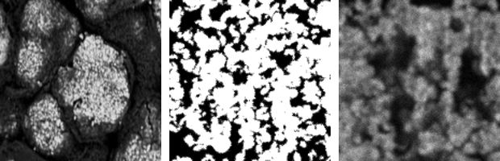
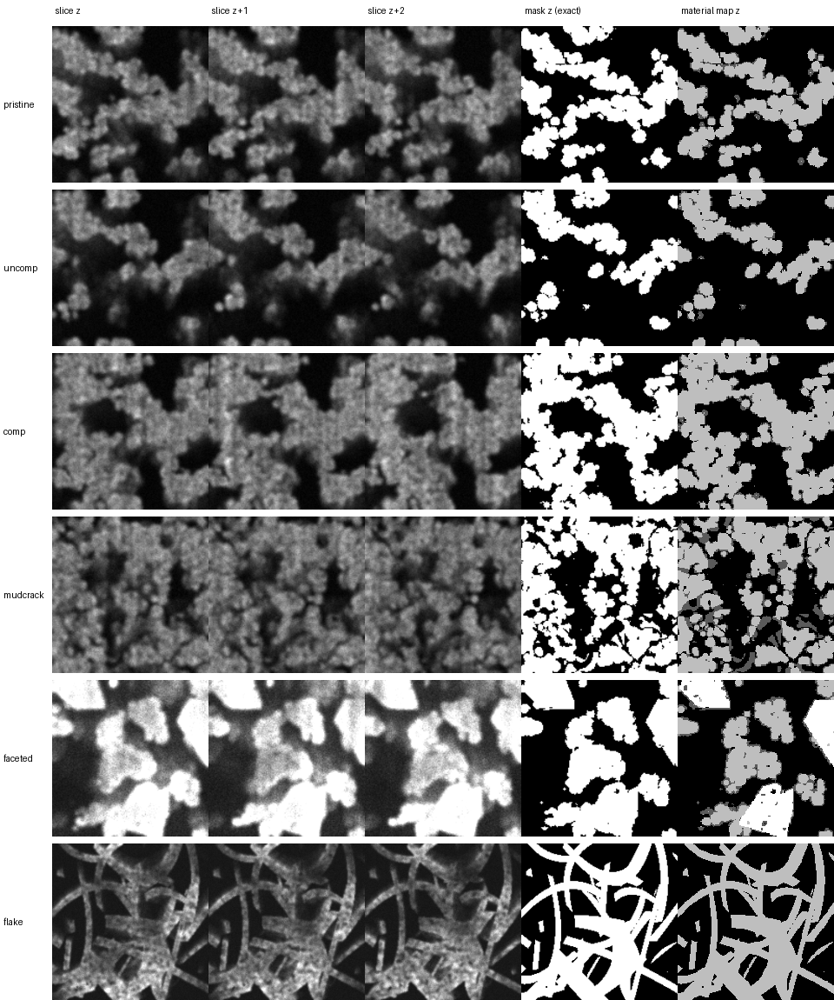
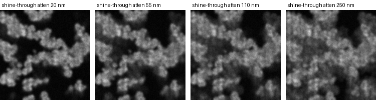
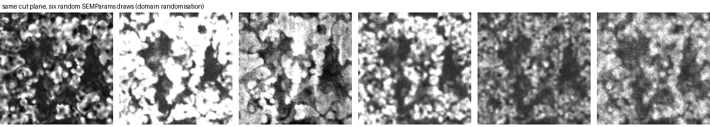
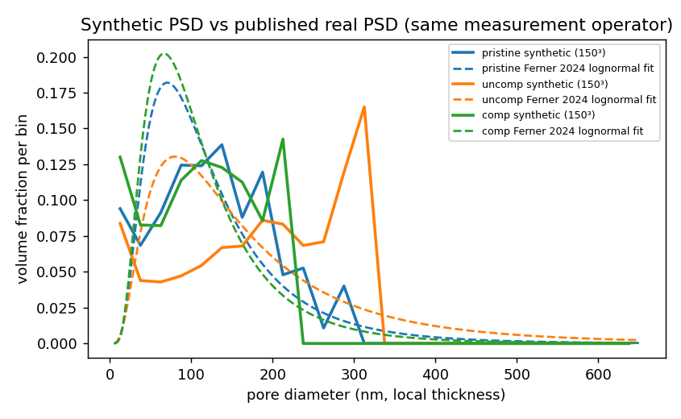
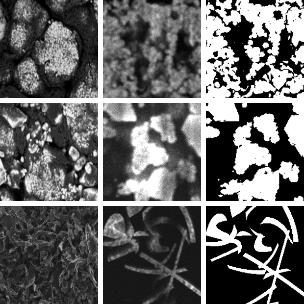
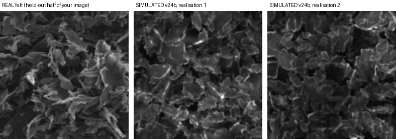
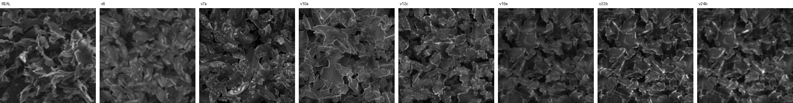
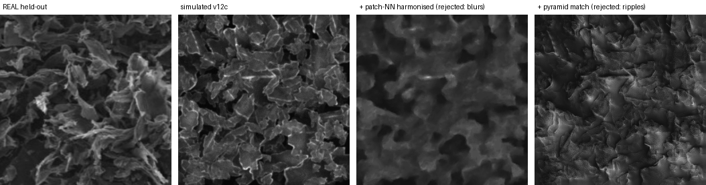

# Synth-to-real gap exploration

**Goal of this directory:** replace the PuMA + Blender synthetic-data pipeline with a generator and
image-formation simulator whose outputs are (a) structurally calibrated against the real pFIB-SEM
data, (b) visually and statistically close to real micrographs, and (c) pixel-aligned with their
ground-truth masks by construction — plus an honest, measurable definition of "close".

Everything here was produced in an iterative loop: generate → render → measure the gap → diagnose →
fix → repeat. All numbers below are reproducible from the code in this directory.

Full documents: [`docs/REEVALUATION.md`](docs/REEVALUATION.md) (project re-evaluation and plan),
[`docs/EVIDENCE_AUDIT.md`](docs/EVIDENCE_AUDIT.md) (what is grounded vs assumed — no made-up facts),
[`docs/APPEARANCE_ML.md`](docs/APPEARANCE_ML.md) (the appearance-gap methodology and the ML route).

---

## 1. Why the old pipeline had to go

1. **Broken training signal.** The Blender renderer produces an oblique perspective view
   (camera tilt 38°, azimuth 85–95°, 1080×720) resized onto an orthographic 150×150 z-slice mask —
   image and label are not pixel-aligned. Consistent with every observed number: senior checkpoint
   val IoU 0.53 *on its own synthetic data*, scratch 0.51, fine-tune 0.50 (a U-Net with exact labels
   should clear 0.9). One-hour test before believing anything else: overlay mask edges on an old
   render, or re-render `--flat`.
2. **Wrong geometry class and scale.** PuMA `sphere` packing, bins 89–1647 nm, 10 nm voxels,
   realized porosity 0.73 vs the real 0.42–0.56 with pores 50–600 nm at 6 nm voxels
   (Ferner et al. 2024 — the paper the Drive stacks come from).
3. **Wrong image formation.** Eevee spotlight ≠ SEM. The old synthetic slice is near-binary
   (75 % of pixels at 0/255, entropy 2.7 bits); real SE images are mid-gray and textured
   (entropy 4.4–4.8 bits).


*Left: real agglomerate micrograph (uploaded reference). Middle: old pipeline output. Right: new simulator.*

## 2. What was built (`eponge_synth/`)

| module | contents |
|---|---|
| `microstructure.py` | `catalyst_layer()` — IrO2/ionomer agglomerate hierarchy (3-scale correlated skeleton, Voronoi mud-crack domains, lognormal primary particles, partial ionomer films, faceted/ellipsoidal dense inclusions, through-plane compression, bisection to exact porosity); calibrated presets `pristine / uncomp / comp / mudcrack / faceted` |
| `felt.py` | `sheet_felt()` — sedimented felt of crumpled sheets (Fourier height field + cylindrical roll + fold creases + torn outlines), ballistic deposition with quantile settling and compaction, geometric edge maps; `mode="fiber"` gives nonwoven fibre mats |
| `sem_render.py` | SE image-formation simulator: 52° (or plan-view) ray-cast shine-through with depth attenuation, thin-feature transmission (low-kV ghosting), secant-law SE contrast + detector direction, geometric edge highlights with physical width, nanoparticle grain, charging/illumination field, curtaining, PSF, shot noise, drift, ambient occlusion, deep-void scatter floor; `SEMParams.random()` for domain randomisation; masks are exactly `material[z] > 0` |
| `descriptors.py` | the gap ruler: local-thickness PSD + lognormal fit (Ferner's definition), porosity, chords, S₂, connectivity, specific surface, the paper's clean-up operator, image texture statistics |
| `calibrate.py` / `domain_adapt.py` | structural calibration against published targets; appearance calibration; FDA + histogram matching |
| `patch_transfer.py` | GPNN-style patch harmonisation, pyramid matching, and the **classifier two-sample test (C2ST)** — the operational definition of "indistinguishable" |
| `training.py` | 2.5D / 3D datasets (frame-safe augmentation), U-Net 2D/3D + DeepLabV3+, CE+Dice + boundary + inter-slice-consistency losses, descriptor-level evaluation (**compiled, not yet executed — run `smoke_test.py` on a GPU box first**) |
| `make_dataset.py`, `cut_train.py` | dataset CLI with domain randomisation; CUT/SinCUT translator with mask-consistency and the C2ST acceptance test (GPU) |


*Six presets: three consecutive simulated slices, the exact pixel-aligned mask, and the material map
(light = catalyst, dark gray = ionomer, white = dense crystallite).* 




## 3. Structural calibration vs the real data (published targets)

Measured at 150³, 6 nm voxels, **through the paper's own measurement operator** (3-D open/close, r = 2)
— the key methodological point: the published PSD numbers are properties of that operator.
Synthetic / target (Ferner 2024 Table 1):

| region | porosity | mean pore (nm) | μ | σ |
|---|---|---|---|---|
| pristine | 0.512 / 0.515 | 128 / 123 | 4.666 / 4.657 | 0.683 / 0.635 |
| uncomp | 0.556 / 0.558 | 185 / 166 | 5.016 / 4.926 | 0.758 / 0.740 |
| comp | 0.414 / 0.417 | 117 / 104 | 4.564 / 4.572 | 0.709 / 0.613 |



Max pore is box-limited at 150³ (0.9 µm); generate ≥ 256³ for the 600 nm tail
(`results/psd_validation_150.json`, `results/calibration_result.json`).

## 4. Appearance calibration vs the two real reference images

References (uploaded): an IrO2 agglomerate micrograph (two panels) and a ×1000 flake-felt surface
micrograph. Calibrated montage (real | simulated | exact mask):



Statistics tables: `results/appearance_table.json`, `results/appearance_gap_table.md`,
fitted parameters: `results/appearance_calibration.json`. Caveats: both references are
low-resolution screenshots; image 1 has no scale bar, so the mud-crack domain size is fitted by eye.

## 5. The felt deep-dive: 24 iterations, measured

"Indistinguishable" was made operational with a **classifier two-sample test**: the felt image was
split — the left half is the only thing any method may learn from, the right half is held-out truth —
and a kNN vote plus a random forest try to separate real patches from synthetic ones at two scales.
The **real-vs-real control** (left vs right half of the *same* micrograph) is the floor:
**0.584 / 0.657 (texture kNN / RF)** and **0.812 / 0.826 (structure)** — the reference is
non-stationary, so 0.5 is unreachable by definition.

Full score table: [`results/felt_c2st_table.md`](results/felt_c2st_table.md). Highlights:

| candidate | tex kNN | tex RF | struct kNN | struct RF |
|---|---|---|---|---|
| real vs real (floor) | 0.584 | 0.657 | 0.812 | 0.826 |
| v6 (first calibrated felt) | 0.677 | 0.834 | 0.829 | 0.958 |
| v12c | 0.627 | 0.786 | 0.856 | 0.946 |
| **v24b (final preset)** | **0.592** | **0.704** | **0.831** | **0.840** |
| v24b, 2nd random realisation | 0.613 | 0.724 | 0.854 | 0.894 |

Test repeatability ±0.005; realisation spread ±0.01 (texture) / ±0.03 (structure).
On the non-parametric test the final felt sits **at the floor at both scales**; the random-forest
residual (+0.05 texture, +0.01–0.07 structure) is joint patch structure — the translator's job.




What each accepted pass fixed (diagnostic-driven; details in `docs/APPEARANCE_ML.md` §6):
deposition instead of random placement → resolution 0.125 µm + roll/fold/torn outlines →
geometric edge maps (killed voxel-terrace "bullseyes") → **shot noise** (the dominant texture cue:
Laplacian std 19 vs 11) → deep-void scatter floor + crevice occlusion → right-skewed highlight tail +
large-scale illumination field (the reference's non-stationarity) → physical edge-highlight width.
Rejected by the test: draping, slab geometry, bimodal populations, pyramid matching, patch-NN
harmonisation (blurs), JPEG-pipeline matching (no effect — verified with a real-image control).



## 6. Layer-by-layer: mesh ground truth vs the simulated micrograph

[`docs/LAYER_BY_LAYER.md`](docs/LAYER_BY_LAYER.md) shows, for the felt, the fibre mat and two
catalyst presets: the ground-truth geometry as 3-D meshes, and at six depths per family a
side-by-side of **clean structure render | exact mask | material map | calibrated SEM simulation**.
Two takeaways visible at a glance: labels and images are pixel-aligned by construction, and for the
~94 %-porous felt the mask is sparse while the image is full of shine-through — the visual proof that
per-slice 2-D segmentation is nearly ill-posed and 2.5-D/3-D context is required.


## 7. What is assumed vs measured

`docs/EVIDENCE_AUDIT.md` lists, item by item: 14 real-data features the old synthetic lacked (each
with its evidence source), and every number in the new pipeline that is **assumed or fitted rather
than measured** (ionomer thickness/coverage/contrast, crack width, domain size, inclusion counts,
shine-through attenuation, noise/PSF magnitudes, compression mechanism, all felt geometry). None of
those should be quoted as fact. The three region presets are calibrated to the paper's published
numbers, **not** yet to the raw stacks in the Drive.

## 8. What to do next (ranked)

1. **Alignment test on the old Blender renders** (1 h) — decides whether every historical IoU was noise.
2. Pull 3–5 **native-resolution real slices** per region: re-run `calibrate_appearance` and replace the
   paper-derived targets with measured ones (`describe_volume` on the stacks) — this changes more than
   anything else here.
3. Generate `datasets/v2` at ≥ 256³ (`make_dataset.py`), run `smoke_test.py`, then Stage A of
   `docs/REEVALUATION.md` §8 (the repo's own U-Net on aligned data: expect IoU > 0.9).
4. Train the **SinCUT translator** (`cut_train.py`, ~1 h on one GPU) with the built-in C2ST acceptance
   test; acceptance = within the control's interval at both scales **and** a frozen segmenter reproduces
   the input masks at > 0.95 IoU on translated images.
5. Tortuosity module (porespy/taufactor) so predictions are scored on the physics the mentor cares about.

## 9. Reproducing

```bash
pip install -r requirements.txt
python make_dataset.py --out datasets/v2 --n 200 --shape 192 256 256 --families catalyst_layer --randomize_beam
python make_dataset.py --out datasets/felt --n 40 --families sheet_felt fiber_felt     # uses results/appearance_calibration.json
python -m eponge_synth.calibrate                     # structural calibration (re-run after generator changes)
python scripts/felt_iter.py                          # the felt iteration harness (edit params in-file)
python smoke_test.py                                 # GPU box: 1-epoch check of every model
```

Directory map: `eponge_synth/` (library) · `docs/` (three reports) · `gallery/` (all figures, montages
and the per-pass iteration trail `felt_pass_*.png`) · `results/` (calibration and C2ST JSON/tables) ·
`samples/real_uploads/` (the two reference crops) · `samples/example_dataset_previews/` ·
`scripts/felt_iter.py`.
