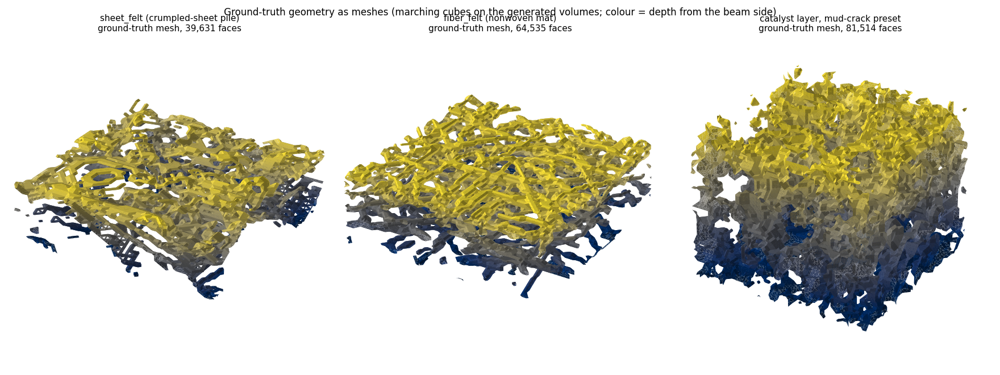
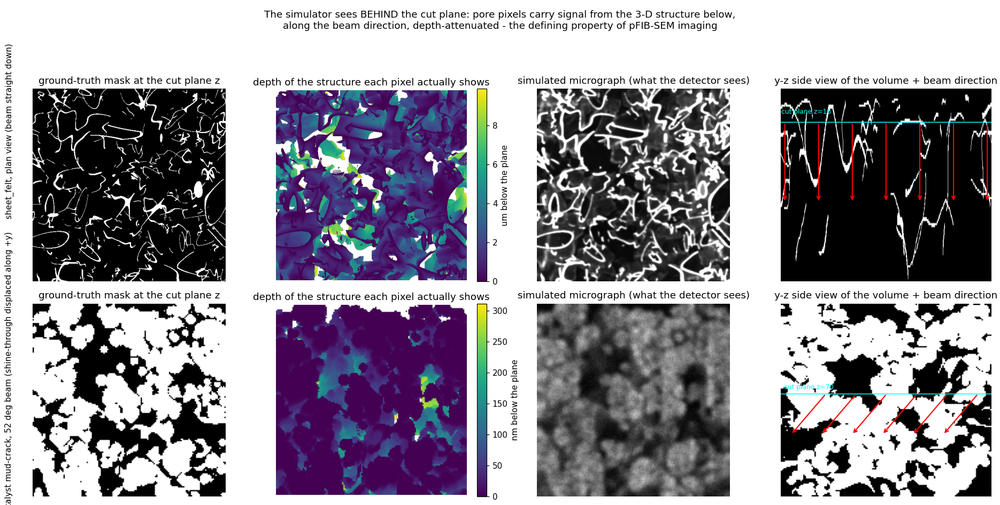
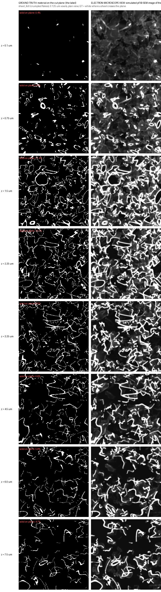
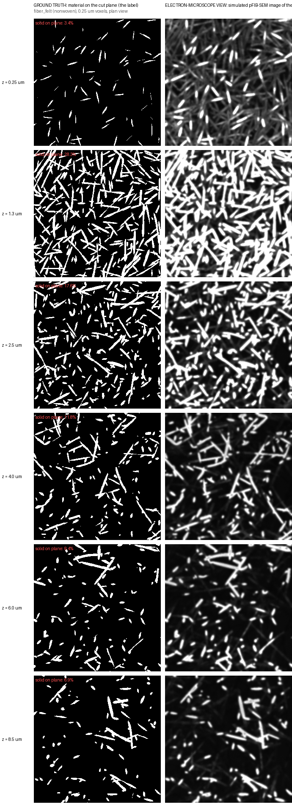
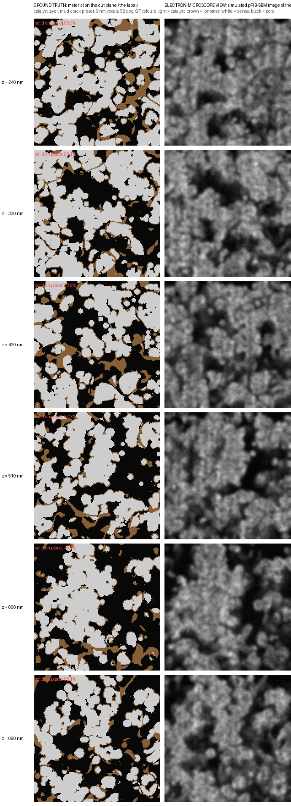
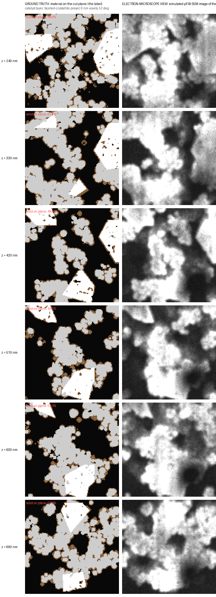
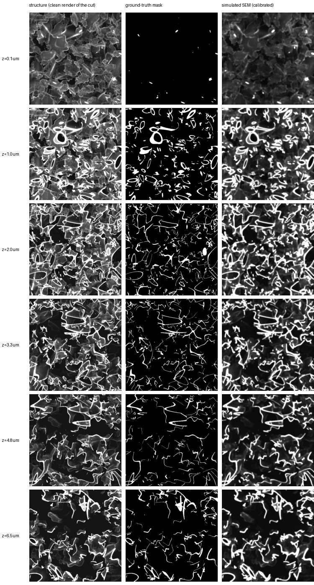
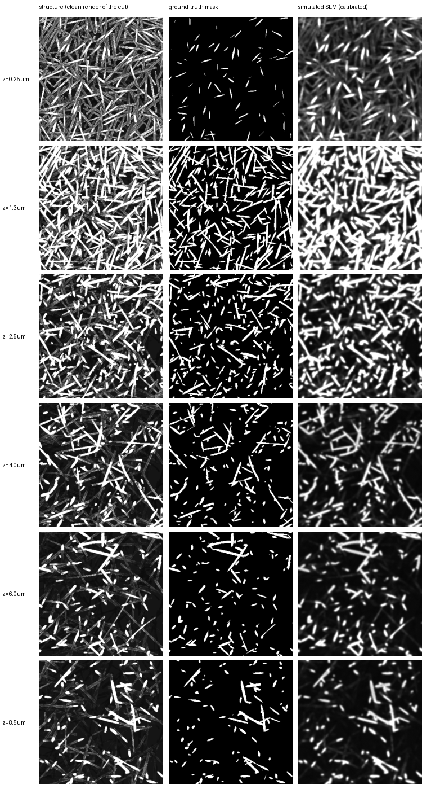
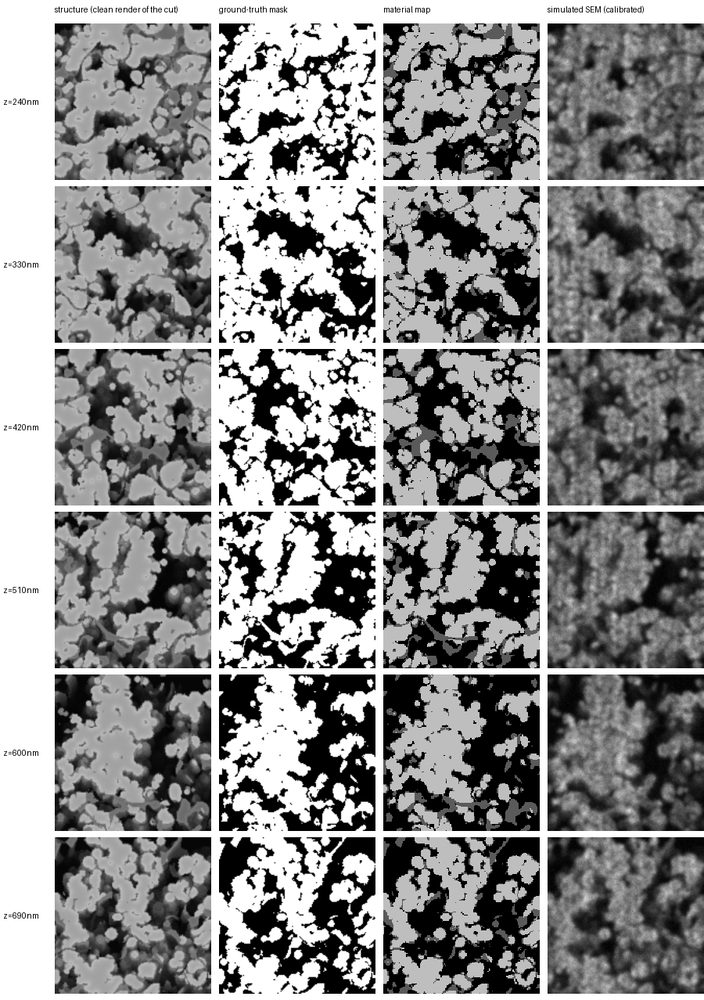
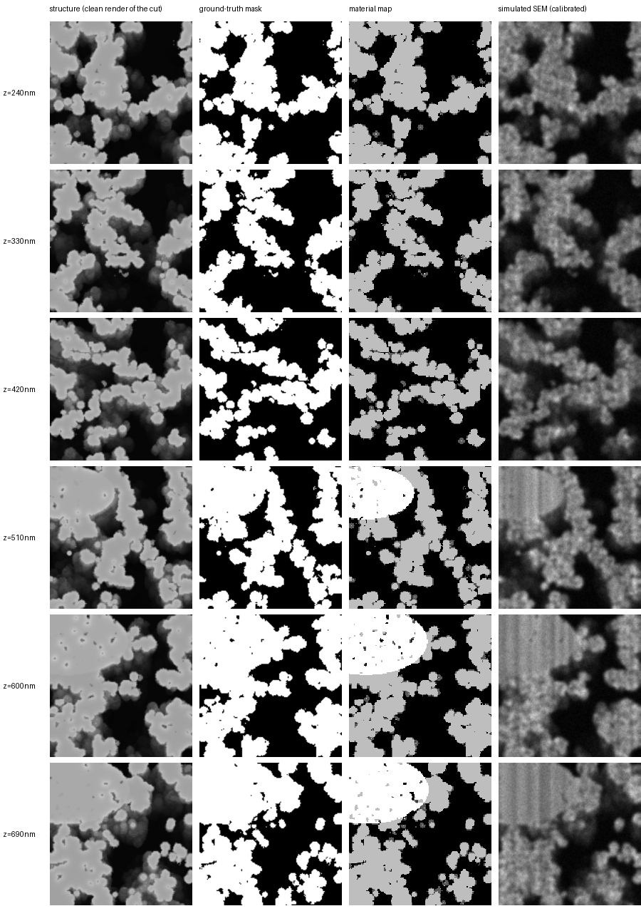

# Layer-by-layer: mesh ground truth vs what the "real" image looks like

This page answers one question end to end: **for the same volume, what does the ground truth look
like (as a 3-D mesh and as per-layer masks), and what does the corresponding micrograph look like at
every layer?** Emphasis on the felt / fibrous-flaky families, where the answer is the most surprising.

Every panel below comes from the same generated volumes; nothing is hand-drawn. The "simulated SEM"
column uses the calibrated parameters whose closeness to the real reference images is quantified in
[`../results/felt_c2st_table.md`](../results/felt_c2st_table.md) (felt preset v24b sits at the
real-vs-real floor on the non-parametric test). Reproduce with
[`../scripts/make_mesh_fig.py`](../scripts/make_mesh_fig.py) and
[`../scripts/make_layer_sheets.py`](../scripts/make_layer_sheets.py).

---

## 1. Ground truth as 3-D meshes

Marching cubes on the generated volumes (the same arrays the masks are sliced from), colour = depth
from the beam side. These are the "mesh ground truth" objects; `skimage.measure.marching_cubes`
gives verts/faces directly if an OBJ export is wanted (the old repo's `utils/convert_mesh.py`
workflow still applies).

Left: the sedimented crumpled-sheet felt (layered pile, deep gaps). Middle: the fibre mat (nonwoven,
in-plane). Right: the mud-crack catalyst layer (agglomerate domains with meandering cracks).

## 1b. Does each layer really see what is behind it? Yes — here is the proof

The simulator marches a ray from every pore pixel of the cut plane into the 3-D volume along the beam
direction (52° for the FIB cut, straight down for a plan view) and records the first solid it hits,
attenuated with depth; thin flakes let part of the beam continue (transmission). The middle panels
below colour every pixel by the depth of the structure that produces its signal.

Numbers for the felt at z = 2 µm: **10 % of pixels are solid on the plane, 82 % show structure from
below** (median 1.25 µm deeper), 8 % see nothing. For the catalyst layer the shine-through is displaced
along +y by the 52° geometry — the "52° streak" the paper removes. The ground-truth mask is never
altered by any of this; only the image is (see `FINDINGS_AND_TRANSFER.md` §1 on signal vs nuisance).

## 1c. Ground truth vs electron-microscope view, side by side

Two columns only — the label on the left, the simulated micrograph of the *same* plane on the right —
at eight depths for the felt, six for the others. The red number is the fraction of the plane that is
solid.

## 2. How to read the four-column layer sheets

Each row is one cut plane at depth *z* (everything above *z* has been milled away, exactly like
FIB serial sectioning). Columns:

1. **structure (clean render of the cut)** — the same ray physics as the simulator with all noise,
   grain, charging, curtaining and drift switched off: a depth-shaded "mesh view" of that layer.
2. **ground-truth mask** — exactly `material[z] > 0`, the training label. Pixel-aligned with the
   images *by construction*; you can verify it by eye: every bright cut face sits on the mask.
3. **material map** (catalyst sheets only) — light = catalyst, dark gray = ionomer, white = dense
   crystallite, black = pore.
4. **simulated SEM (calibrated)** — the realistic image the model actually trains on.

## 3. Felt (crumpled sheets) — the extreme case

What this sheet demonstrates:

* **The mask is sparse, the image is full.** At ~94 % porosity, a cut plane intersects only thin
  ribbon cross-sections (~5–10 % of pixels), yet the image shows structure almost everywhere —
  all of it shine-through from sheets *below* the plane. Per-slice 2-D segmentation of such a
  material is close to ill-posed: most of what a human "sees" in a single frame is not on that
  plane and must be labelled pore. This is the strongest visual argument in the whole repo for
  2.5-D / 3-D context.
* **The top row (z = 0.1 µm) is the limit case**: the mask is almost empty (the cut grazes the
  topmost sheets) while the image shows the entire pile.
* **Slicing behaves physically**: as z increases, sheets that were bright cut faces at shallower z
  vanish (milled away) and previously-hidden sheets surface — consecutive layers are correlated the
  way real serial sections are, which is what the 2.5-D consistency loss exploits.
* **Alignment audit for free**: cut faces in columns 1 and 4 coincide with column 2 exactly; the
  failure mode of the old Blender pipeline (oblique render vs orthographic mask) cannot occur here.

## 4. Fibre mat (nonwoven)

Same reading: circular/elliptical fibre cross-sections on the mask, shine-through of the crossing
fibres below in the image; the mat's in-plane anisotropy is visible in how cross-sections elongate.

## 5. Catalyst layer at 52° (the funded target)

Mud-crack preset and the Ferner-calibrated `pristine` preset, six depths each:

What these show:

* **Pores are not dark.** At 52°, every crack and pore is filled with the texture of deeper
  agglomerates (shine-through displaced along the beam) — the central ambiguity the paper's
  reslice-and-threshold pipeline fights, and the reason intensity thresholding cannot label these
  images.
* **Ionomer is between the classes.** The material map's dark-gray ionomer films render darker than
  catalyst but brighter than deep pore; a per-pixel intensity cannot separate "ionomer" from
  "shadowed pore" — geometry context can. (Labels follow the paper: ionomer counts as solid.)
* **The mask carries structure the image blurs**: nanoscale interstices inside agglomerates are
  present in the mask at 6 nm voxels but visually merge in the realistic render — matching how the
  paper's segmentation (3-D open/close) treats them.

## 6. Caveats, so nothing here over-claims

* The "simulated SEM" columns are the *calibrated simulator*, not real micrographs; their measured
  distance to the two real reference images is in `../results/felt_c2st_table.md` and
  `../docs/APPEARANCE_ML.md`. The felt is at the kNN floor; the catalyst appearance is fitted to a
  screenshot without a scale bar.
* Depth values are exact for the volumes shown; real stacks add registration jitter and milling
  thickness variation, which `SEMParams.random()` covers only partially (per-slice drift, not
  geometric jitter).
* The fibre mat volume predates the final felt recipe (coarser 0.25 µm voxels); regenerate with
  `sheet_felt(mode="fiber")` at 0.125 µm for production data.
